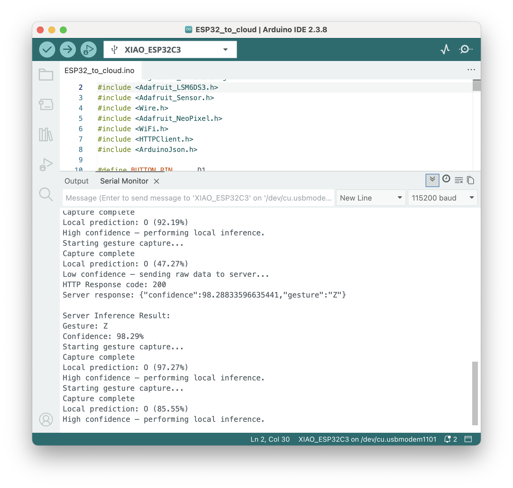

# Lab 5 Report — Edge-Cloud Offloading

## Serial Monitor Screenshots

### Local Inference (High Confidence)



### Cloud Inference (Low Confidence)


---

## Discussion Questions

### Is server's confidence always higher than wand's confidence from your observations? What is your hypothetical reason for the observation?

From our observations, the server's confidence is consistently higher than the local wand confidence when offloading occurs. In one example, the local model predicted O at 47.27% and the server returned Z at 98.29%. In another, the local model gave O at 52.73% and the server returned Z at 95.47%.

The most likely reason is that the server runs a full MLPClassifier trained on all available data without the memory and compute constraints of an edge device. The on-device Edge Impulse model is quantized and compressed to fit within the microcontroller's limited flash and RAM, which can reduce its ability to distinguish between gestures that produce similar sensor patterns. The server model has no such constraints and can retain finer decision boundaries between classes.

### Sketch the data flow of this lab.

```
[User presses button]
        |
        v
[ESP32 captures 1 second of accelerometer data]
        |
        v
[Local Edge Impulse model runs inference]
        |
   Confidence >= 80%?
      /         \
    YES           NO
     |             |
[Actuate LED  [Send raw feature array as JSON
 locally]      via HTTP POST to Flask server]
                   |
                   v
          [Server scales input,
           runs MLPClassifier]
                   |
                   v
          [Returns gesture label
           and confidence as JSON]
                   |
                   v
          [ESP32 actuates LED
           based on server result]
```

### Our approach is edge-first, fallback-to-server when uncertain. Analyze pros and cons from the following aspects: reliance on connectivity, latency, prediction consistency, data privacy.

**Reliance on connectivity:** The system works without a network connection for the majority of predictions as long as local confidence is high. This makes it resilient in environments with intermittent WiFi. However, uncertain cases that fall below the threshold will fail silently or stall if the server is unreachable, meaning the system is not fully offline-capable.

**Latency:** Local inference completes in milliseconds on the microcontroller, making high-confidence predictions fast and responsive. Cloud offloading adds meaningful network round-trip delay. In this lab the HTTP POST and response took noticeable additional time compared to local-only inference, which would be unacceptable in latency-sensitive applications.

**Prediction consistency:** The server model tends to produce higher-confidence, more decisive results for ambiguous inputs. However, the local and server models can disagree on the predicted class (as seen when local predicted O but server returned Z), which introduces inconsistency in the user experience depending on which path is taken.

**Data privacy:** High-confidence gestures are classified entirely on-device and no sensor data leaves the hardware. However, whenever the local model is uncertain, raw accelerometer feature arrays are transmitted to the server over HTTP without encryption, exposing potentially sensitive motion data to interception. This is a meaningful privacy risk if the gesture data is associated with personal behavior.

### Name a strategy to mitigate at least one limitation named in question 3.

To address the data privacy limitation, the raw sensor data sent to the server could be transmitted over HTTPS with TLS encryption rather than plain HTTP. This prevents interception of the accelerometer payload in transit. A more thorough approach would be to apply on-device feature reduction before transmission, sending a compressed representation instead of the full raw array, so that even if the data were intercepted it would not be directly interpretable as motion data.
